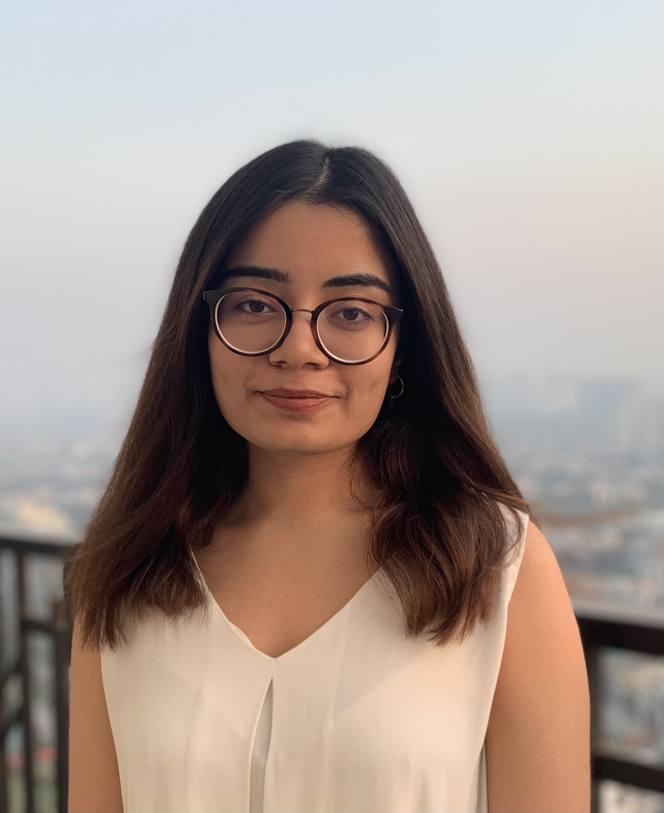

I am Vasuda Kapoor, an MPH candidate at Columbia University. 

I am passionate about utilizing novel biostatistical techniques to understand disease risk in cancer patients and improve their health outcomes in minority communities. 

Here's a summary of my academic and professional experience:
[resume](resume.html).

Here's a link to my GitHub account: 
[Github](https://github.com/vasudakapoor24)

You can reach out to me via  or [LinkedIn](https://www.linkedin.com/in/vasuda-kapoor-4608461a5/). 
